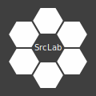

= SrcLab Base: Base and Center of Source Lab
Sun Qian <fredsuvn@163.com>
:encoding: UTF-8
:emaill: fredsuvn@163.com
:url: https://github.com/srclab-projects/boat
:license: https://www.apache.org/licenses/LICENSE-2.0.html[Apache 2.0 license]

:qq-group: QQ group: 1037555759
:boat-version: 0.0.0

== Introduction

This repository is base of SrcLab -- Source Lab --  an organization which is interested in, studies, researches and plays everything.
The base stores SrcLab's global static resources, metadata, public infos, shared manuals, template files, tools and more other resources.

== Resources

* link:infos/[infos/]: Public and shared infos;

* link:manuals/[manuals/]: Shared manuals and books;
** link:manuals/git/[git/]: Git manual;
** link:manuals/cert/[cert/]: About cert;
** link:manuals/windows/[windows/]: About Windows;

* link:templates/[template/]: Template files;
** link:templates/editor-config/[editor-config/]: Editor config files, such as .gitignore, .editorconfig;
** link:templates/docs/[docs/]: Document template files;
** link:templates/gradle/[gradle/]: Gradle Project Templates;
*** link:templates/gradle/kotlin/[Kotlin/]: Kotlin project templates;
*** link:templates/gradle/kotlin-spring-boot/[kotlin-spring-boot/]: Kotlin Spring Boot project templates;
** link:templates/maven/[maven/]: Maven Project Templates;
*** link:templates/maven/kotlin/[Kotlin/]: [line-through]#Kotlin templates# (Use Gradle for Kotlin);
** link:templates/logging/[logging/]: Logging template files;
** link:templates/svg/[svg/]: SVG template files;

* link:tools/[tools/]: Tools;

* link:arts/[arts/]: Arts is a collection of logos, fonts and other artworks about SrcLab;
** link:arts/logos/[logos/]: Logos;
** link:arts/fonts/[fonts/]: Fonts;

* link:misc/[misc]: Other resources;
** link:misc/brew/[brew/]: Brew files;

== Contribution and Contact

* {emaill}
* {url}
* {qq-group}

== License

{license}